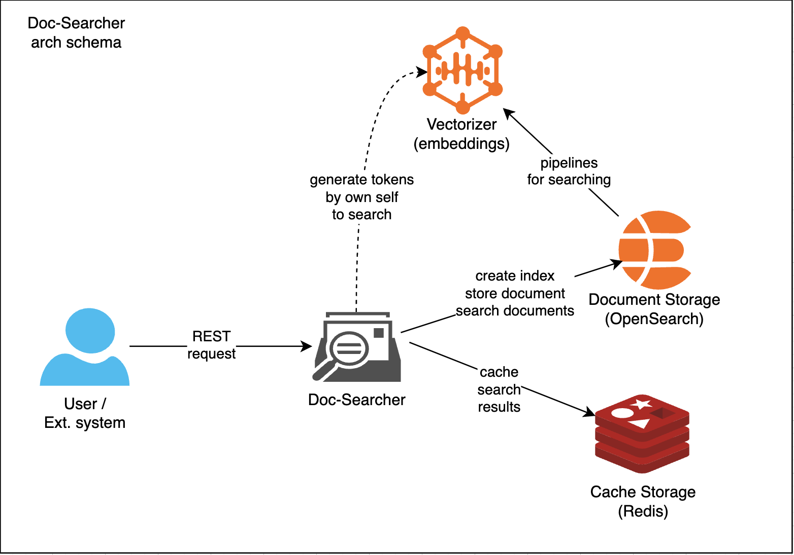

# Doc-Searcher Metaverse project

Doc-Searcher is the simple and flexible searching documents application, leveraging the capabilities of Rust and Opensearch
to provide efficient and effective full-text search in documents. This project aims to offer a straightforward solution for
indexing and searching through a large corpus of documents with the speed and accuracy provided by Opensearch.

The main goal is implement simple and powerful system of storing and indexing documents with searching functionality 
(full-text, semantic and hybrid). I decided to use opensearch as default searching engine, but you may use own solutions 
by implementing several async traits for Tantivy, QDrant or own solution:

The principle schema:

Doc-Searcher includes following sub-services:
 - Cache Service       - API of caching service like Redis;
 - Metrics Service     - API of metrics to Prometheus monitoring;
 - Storage Service     - API (CRUD) of indexed folders and documents;
 - Searcher Service    - API of searcher functionalities (fulltext, semantic, hybrid);
 - Embeddings Service  - API of embeddings service if you would like to use own model.
 
!!! Searcher and Storage services at this moment has common implementation with opensearch

## Features

- **Full-Text Search**: Quickly find documents based on content based on choose searching engine;
- **Semantic Search**: Fast semantic searching by external embeddings service;
- **Hybrid Search**: Fast hybrid searching by external embeddings service;
- **Rust Performance**: Benefit from the speed and safety of Rust;
- **REST API**: Easy to use REST API for searching documents and control management of indexing;
- **Docker Support**: Easy deployment with Docker and docker-compose;
- **Caching Actor**: Store data to cache service like Redis or own solutions;
- **Remote logging**: Send error or warning messages or other metrics to remote server;
- **Swagger**: Using swagger documentation service for all available endpoints;
- **Parsing and storing**: Allows to parse and store files to searching engine localy.

## Getting Started

These instructions will get you a copy of the project up and running on your local machine for development and testing purposes.

### Prerequisites

- Rust
- Docker & docker-compose
- Cache (Redis)
- Opensearch

### Quick Start

1. Clone the repository
2. Run `cargo install --path .` to build project
3. Setting up `.env` file with services creds
4. Run `cargo run --bin init-pipelines` to init elasticsearch schemas
4. Run `cargo run --bin launch` to launch service

### Features of project

Features to parse and store documents localy from current service (Not stable):
 - enable-cache-redis    - enable cacher service like redis oe other custom implementation;
 - enable-unique-doc-id  - enable generating unique document id based on index and file_path string value.

